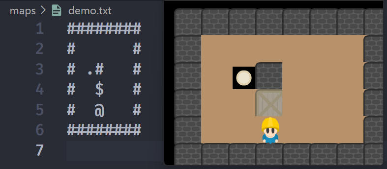
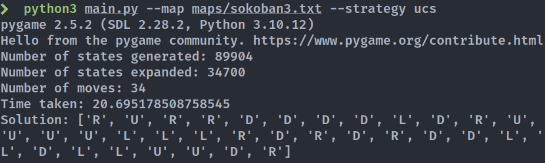
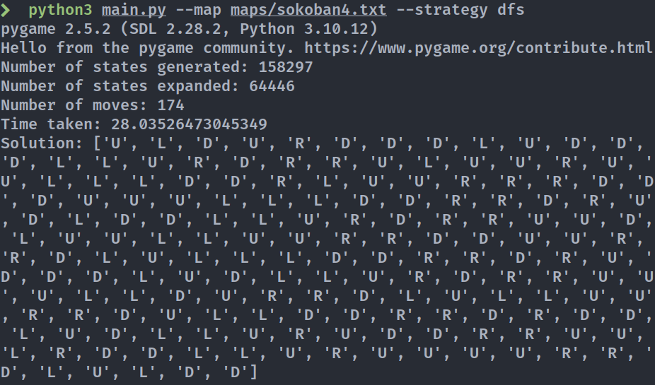

# CS300 Artificial Intelligent - Lab Midterm Project

> **Instructors:** _Dr. Nguyen Ngoc Thao, Msc. Do Trong Le - Nguyen Quang Thuc_
>
> **Students:** _Dao Minh Duc - 2159003, Nguyen Bao Ngoc - 2159009_

## Project Description

This project is a part of the course CS300 - Artificial Intelligent at ITEC, HCMUS. The project is about implementing a simple AI to play the game "Sokoban", programmed in Python, using the Pygame library for the GUI. The game is a classic puzzle game where the player has to push boxes to the target locations. The game is considered solved when all boxes are on the target locations.

The rules of the game are as follows:

-   The player can move in four directions: up, down, left, right.
-   The player can push a box if there is no obstacle behind the box.
-   The player can only push one box at a time.
-   The player cannot move through walls or boxes.
-   The game is considered solved when all boxes are on the target locations.
-   The cost of every move is equal.

### Game State Representation

Each step of the solution will be represented as a state of the game. Each state is represented as a 2D array, where each cell contains the information of the object in that cell:

-   Empty: ` ` (space)
-   Wall: `#`
-   Box: `$`
-   Target: `.`
-   Player: `@`
-   Box on target: `*`
-   Player on target: `+`

<br/>

<br/>

<br/>

Example:



The neighbor (or successor) states of a state are the states that can be reached from the current state by moving the player in one of the four directions, or by pushing a box in one of the four directions. States will be deduplicated and stored in a queue, stack, or priority queue, depending on the algorithm used.

### Algorithms

The program will read the input from a file, which contains the initial state of the game. It will then use a specific search algorithm specified by user to solve the game. The solution will be displayed on the GUI, and the additional information will be printed to the console. The following algorithms will be implemented:

-   Breadth-First Search (BFS)
-   Depth-First Search (DFS)
-   A\* Search
-   Uniform Cost Search (UCS)
-   Greedy Best-First Search
-   and a custom algorithm

To help minimize the number of states generated, the program can identify whether a state has box(es) that is stuck in a corner and will not add those states into the queue/stack. It will also help to identify whether a map can be solved without having to generate all possible states.

Due to the rule _"The cost of every move is equal"_, BFS and UCS are expected to perform quite similarly.

### Heuristics

For algorithms that use heuristics (A\*, GBFS), the sum of Manhattan distances of each box on the board to its nearest target will be used.

Hamming distance will not be suitable for this problem, since until a state with at least one box on a target is reached, the Hamming distance will be equal to $N \times 2$, with $N$ being the number of boxes on the board.

#### Benchmark

**System Specification**

| Property  | Value                               |
| --------- | ----------------------------------- |
| OS        | Ubuntu 22.04.4 LTS, 64-bit          |
| Processor | Intel® Xeon(R) E5-2680 v4 @ 2.40GHz |
| Memory    | 256.0 GiB                           |

**Results**

`maps/sokoban1.txt`

```
######
#    #
# #  #
#*$ .#
#@####
# ####
######
```

| Algorithm | Time (s) | No. Nodes Generated | No. Nodes Expanded | Solution Length |
| --------- | -------- | ------------------- | ------------------ | --------------- |
| BFS       | 0.005    | 36                  | 19                 | 8               |
| DFS       | 0.003    | 25                  | 12                 | 8               |
| UCS       | 0.006    | 36                  | 19                 | 8               |
| A\*       | 0.006    | 37                  | 20                 | 8               |
| GBFS      | 0.004    | 28                  | 14                 | 8               |

<br/>

<br/>

<br/>

<br/>

<br/>

<br/>

<br/>

<br/>

<br/>

<br/>

`maps/sokoban2.txt`

```
#######
###@ .#
# $ #.#
#  $$ #
#.  # #
#   $.#
#######
```

| Algorithm | Time (s) | No. Nodes Generated | No. Nodes Expanded | Solution Length |
| --------- | -------- | ------------------- | ------------------ | --------------- |
| BFS       | 6.689    | 41532               | 17251              | 144             |
| DFS       | 5.372    | 32514               | 13558              | 547             |
| UCS       | 7.199    | 41530               | 17251              | 144             |
| A\*       | 7.175    | 41509               | 17242              | 144             |
| GBFS      | 6.797    | 38393               | 15920              | 198             |

`maps/sokoban3.txt`

```
########
###   ##
#.@$  ##
### $.##
#.##$ ##
# # . ##
#$ *$$.#
#   .  #
########
```

| Algorithm | Time (s) | No. Nodes Generated | No. Nodes Expanded | Solution Length |
| --------- | -------- | ------------------- | ------------------ | --------------- |
| BFS       | 21.127   | 95987               | 36761              | 34              |
| DFS       | 431.402  | 2017390             | 784578             | 142             |
| UCS       | 20.695   | 89904               | 34700              | 34              |
| A\*       | 8.312    | 35011               | 13669              | 34              |
| GBFS      | 4.857    | 21881               | 8591               | 38              |

`maps/sokoban4.txt`

```
#######
#     #
# #$@ #
# * *##
##.* ##
# $ .##
#    ##
#######
```

| Algorithm | Time (s) | No. Nodes Generated | No. Nodes Expanded | Solution Length |
| --------- | -------- | ------------------- | ------------------ | --------------- |
| BFS       | 27.043   | 156302              | 63570              | 72              |
| DFS       | 28.035   | 158297              | 64446              | 174             |
| UCS       | 28.523   | 156082              | 63483              | 72              |
| A\*       | 29.188   | 154006              | 62610              | 72              |
| GBFS      | 13.364   | 73228               | 29993              | 108             |

> [Proof of result](#proof-of-result) can be found inside [Appendix](#appendix) at the end of the document.

### Usage

**Arguments:**

-   `--map`: The path to the file containing the initial state of the game. The default value is `maps/demo_1.txt`.
-   `--strategy`: The search algorithm used to solve the game. The default value is `bfs`. The possible values are `bfs`, `dfs`, `ucs`, `astar`, `greedy`, and `custom`.

```bash
python main.py --map maps/custom_map.txt --strategy astar
```

**Notes**

-   The program requires Python 3, and the Pygame library to be installed (`pip install pygame`).

<br/>

<br/>

<br/>

<br/>

## Project Structure

-   `assets`: The folder containing the assets used in the GUI.
-   `main.py`: The main file of the program.
-   `maps`: The folder containing the initial state files of the game.
-   `modules`: The folder containing the main modules of the program.
    -   `game_state.py`: The module containing the `GameState` class, which represents the state of the game.
    -   `game_visualization.py`: The module containing the `GameVisualization` class, which is responsible for the GUI.
    -   `solver.py`: The module containing the `Solver` class, which is responsible for solving the game using different algorithms.

## Appendix

### Proof of result

#### System configuration


<br/>

<br/>

<br/>

<br/>

<br/>

<br/>

<br/>

#### sokoban1.txt


<br/>

<br/>

<br/>

<br/>

<br/>

<br/>

<br/>

<br/>

<br/>

<br/>

<br/>

<br/>

<br/>

<br/>

<br/>

<br/>

<br/>

<br/>

<br/>

<br/>

#### sokoban2.txt


#### sokoban3.txt





#### sokoban4.txt





